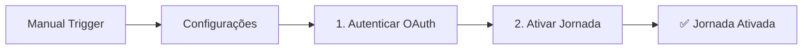

# 🚀 Workflow N8N - Ativar Jornada Marketing Cloud

Workflow completo para ativar jornadas do Salesforce Marketing Cloud via N8N, sem necessidade de código.

## 📋 Pré-requisitos

1. **Conta N8N** (pode usar a versão cloud gratuita: https://n8n.io)
2. **Credenciais Marketing Cloud**:
   - Client ID
   - Client Secret
   - Subdomain (ex: `mc123456789`)
   - Account ID (MID)
   - Journey ID (UUID da jornada)

---

## 🔧 Como Obter as Credenciais

### 1. Acessar Marketing Cloud
- Entre no Marketing Cloud
- Vá em **Setup → Apps → Installed Packages**

### 2. Criar/Usar Pacote
- Clique em **New** (ou use um existente)
- Dê um nome (ex: "N8N Integration")
- Salve

### 3. Adicionar Componente
- Clique em **Add Component** → **API Integration**
- Marque **Server-to-Server**
- Selecione as permissões:
  - ✅ Journeys → Read e Write
  - ✅ Automation → Execute

### 4. Copiar Credenciais
Você verá:
```
Client ID: xxxxxxxxxxxxxxxxxxxxxx
Client Secret: xxxxxxxxxxxxxxxxxxxxxx
Authentication Base URI: https://mcXXXXXXXXX.auth.marketingcloudapis.com
REST Base URI: https://mcXXXXXXXXX.rest.marketingcloudapis.com
```

**Importante**: O `subdomain` é o `mcXXXXXXXXX` que aparece nas URIs.

### 5. Obter Journey ID
- No Marketing Cloud, vá em **Journey Builder**
- Abra a jornada que quer ativar
- Na URL, copie o ID (UUID):
  ```
  https://.../journey/xxxxxxxx-xxxx-xxxx-xxxx-xxxxxxxxxxxx
                      👆 Este é o Journey ID
  ```

---

## 📥 Como Importar no N8N

### 1. Acessar N8N
- Entre no seu N8N (cloud ou self-hosted)

### 2. Importar Workflow
1. Clique em **Workflows** (menu lateral)
2. Clique no **+** (novo workflow)
3. Clique nos **3 pontinhos** (⋯) no canto superior direito
4. Selecione **Import from File**
5. Escolha o arquivo `marketing-cloud-ativar-jornada.json`

### 3. Configurar Credenciais
1. Abra o node **"Configurações"**
2. Substitua os valores:
   ```
   client_id: Cole seu Client ID
   client_secret: Cole seu Client Secret
   subdomain: Cole apenas o mcXXXXXXXXX (sem https://)
   account_id: Cole seu Account ID (MID)
   journey_id: Cole o UUID da jornada
   ```
3. Clique em **Execute Node** para testar

### 4. Testar Workflow
1. Clique em **"Quando clicar aqui"** (trigger manual)
2. Clique em **"Execute Workflow"**
3. Acompanhe a execução:
   - ✅ Verde = Sucesso
   - ❌ Vermelho = Erro (veja o log)

---

## 🔄 Como Funciona



### Passos do Workflow:

1. **Configurações**: Armazena suas credenciais
2. **Autenticar Marketing Cloud**:
   - Faz POST em `/v2/token`
   - Retorna `access_token`
3. **Ativar Jornada**:
   - Faz PUT em `/interaction/v1/interactions/{journey_id}`
   - Envia `{"status": "Running"}`
   - Retorna confirmação

---

## 🎯 Exemplos de Uso

### Ativar uma jornada específica
- Configure o `journey_id` no node **Configurações**
- Execute o workflow

### Ativar múltiplas jornadas
1. Adicione um node **Code** após Configurações
2. Liste os IDs das jornadas
3. Use um **Loop** para ativar cada uma

### Automatizar ativação
- Substitua o **Manual Trigger** por:
  - **Schedule Trigger** (diariamente, semanalmente)
  - **Webhook Trigger** (via API externa)
  - **Email Trigger** (quando receber email)

---

## ⚠️ Troubleshooting

### Erro: "Unauthorized" ou 401
- ✅ Verifique Client ID e Secret
- ✅ Confirme que o subdomain está correto
- ✅ Verifique se o Account ID (MID) está certo

### Erro: "Journey not found" ou 404
- ✅ Confirme o Journey ID (UUID)
- ✅ Verifique se a jornada existe no Marketing Cloud

### Erro: "Insufficient privileges" ou 403
- ✅ No Installed Package, adicione permissões:
  - Journeys → Read, Write
  - Automation → Execute

### Erro: "Invalid status transition"
- A jornada já pode estar ativa
- Verifique no Journey Builder

---

## 📝 Notas Importantes

- ⚡ O token OAuth expira em ~20 minutos (renovado automaticamente)
- 🔒 **Nunca compartilhe** o Client Secret
- 💾 No N8N Cloud, as credenciais ficam criptografadas
- 🌐 Funciona direto do navegador, sem instalar nada

---

## 🆘 Suporte

- **Marketing Cloud API Docs**: https://developer.salesforce.com/docs/marketing/marketing-cloud/guide/getting-started.html
- **N8N Docs**: https://docs.n8n.io
- **Journey Builder API**: https://developer.salesforce.com/docs/marketing/marketing-cloud/guide/postInteractionAsyncSave.html

---

## ✅ Checklist Rápido

- [ ] Tenho conta no N8N
- [ ] Tenho Client ID e Secret do Marketing Cloud
- [ ] Sei meu subdomain (mcXXXXXXXXX)
- [ ] Tenho o Account ID (MID)
- [ ] Tenho o Journey ID da jornada
- [ ] Importei o workflow no N8N
- [ ] Configurei as credenciais no node "Configurações"
- [ ] Testei o workflow

**Pronto! Sua jornada será ativada com um clique! 🎉**
